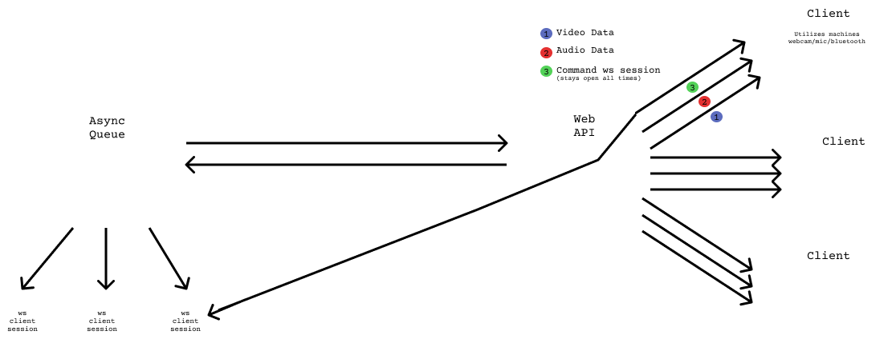

# Overview 
-CharlesBot is system that can receive commands, execute, them, and perform actions/send results back to the original client device. It is also designed to be easily scalable, modular, and easy to develop --Basically a really cool voice assistant. Additionally, CharlesBot provides an API to stream/handle all client visual/audio data and have tasks performed on it, like object/movement detection, voice recognition, etc. 
* Any device (Pi's, laptops, mobile devices) running a CharlesBot client can connect to the host machine
* The CharlesBot host is a system comprised of 3 components: An API interface, an asynchronous task queue, and a Mongo database
* Clients connect to the API interface and stream back audio/video/text data, where it is analyzed and stored 
* Specifically, the audio data is put through a speech-to-text model
* Through the audio data or direct text (from a browser client), the user makes a request by asking charles something
* Using a classifier model, Charlesbot recognizes when the user asks something and what they want done, and creates a formal request to pipe to the asynchronous task queue
* The task queue works on the task and pipes back results to the client through the API in real time. A user can then see results and send followups directly back
* The tech stack involves python's FastAPI, MongoDB change streams, react for the front end, and websockets for most communications through the API, allowing for high performance

    

# Async Task Queue
-The AsyncQueue itself starts out as a barebone, modular structure that the user can add 'modules' to.
* These 'modules' are implemented as a `Feature` class
* Instances of these classes are imported into the file where the task queue is initialized and added simply by the line: `taskQueue.add_task(featureObject)`
* Queue maintains a constant connection with the API Interface for any new task requests from a user in real time
* Can handle multiple requests at once asynchronously and return/receive information from users
* Uses a custom async event loop that is able to have more events added onto it in real time without the loop terminating

## Feature Class
-A 'Feature' is a new type of task the queue is able to execute. Once Features are added, CharlesBot will know how to fulfill those tasks if promted by a user.
* The feature class takes in two params: `task_func` and `intents`
* `task_func` is essentially a coroutine defined by the developer that completes the task for the user. Within it, the developer can add followup inquires that can  promt the user for more information. Once the task is completed, it returns the results back to the user
* `intents` is a list of example inquires the user might say that will trigger CharesBot to start a new task
    * The intents automatically get added to the API's intent classifier training data, and the model gets re-trained. 

# API Interface 
-Clients connect to the host machine and send all peripheral data through the API interface 
* Video/audio/text data are streamed from client using websockets and stored/analyzed by the respective endpoints
* All incoming audio is trasncribed to text and then put through an intent classifier, if the text is thought to be a command from the user
* The intent classifer determines what task the queue needs to perform in order to fulfill the user's request; a formal request body is formed containing parameters from the client device and sent to the task queue for completion 
* Some tasks require the user and the host to talk back and forth until completion; the conversation is piped through the API and stored in a mongoDB replica set as a 'Conversation' document. 

# Future Implementations
*Make name customizable; allow developer to implement something other than 'Charles'
*Add a attribute to the `Feature` class to signify if it can be run on a lighter device, like a raspberry pi
    *Create functionality for CharlesBot to go into 'light mode' for when being hosted on something like a pi; only accept and run tasks that are not CPU intensive
*Host CharelseBot Client on seperate repo

